# 🛒 Fullstack E-Commerce App
> 📌 **Showcase Repository:** This repository serves as a showcase for the project. The source code is maintained in separate frontend and backend repositories.

## 🔗 Project Repositories
- 💻 Frontend: [FullstackEcommers_Frontend](https://github.com/ALIM23700/FullstackEcommers_Frontend)
- ⚙ Backend: [FullstackEcommers_Backend](https://github.com/ALIM23700/FullstackEcommers_Backend)

## 🌐 Live Demo
[Click here to view the live app](https://fullstack-ecommers-frontend.vercel.app/)

## 🧩 Project Overview
This is a full-stack e-commerce application built with React (frontend) and Node.js + Express (backend).  
It allows users to browse products, add items to the shopping cart, checkout, and includes an admin panel for managing products.  
The app features user authentication, real-time updates, and a responsive design for both desktop and mobile.

## ⚙️ Tech Stack
- **Frontend:** React, Tailwind CSS
- **Backend:** Node.js, Express.js  
- **Database:** MongoDB  
- **Authentication:**  JWT  
- **Deployment:** Vercel (frontend), Render (backend)

  ## ✨ Features
- Fully **responsive design** for desktop and mobile  
- **User authentication** (signup/login/logout)  
- **Admin panel** to manage products, users, and orders  
- **Product filtering** by category, price, and other criteria  
- **Shopping cart system** with add/remove items functionality  
- **Checkout process** with integrated **payment gateway**  
- **SSL e-commerce security** for safe transactions  
- Real-time updates for cart and order status  
- Detailed **product pages** with images and descriptions  
- Easy-to-navigate **UI/UX** using Tailwind CSS

 ## 📁 Project Structure
- Frontend code → lives in my [FullstackEcommers_Frontend](https://github.com/ALIM23700/FullstackEcommers_Frontend) repo  
- Backend code → lives in my [FullstackEcommers_Backend](https://github.com/ALIM23700/FullstackEcommers_Backend) repo  
- This README → provides project overview, features, and repo links

- ## ⚙️ Setup Instructions
This repository serves as a showcase for the project. The source code is maintained in separate frontend and backend repositories.
To run the project locally, please check the individual repositories:

- **Frontend:** [FullstackEcommers_Frontend](https://github.com/ALIM23700/FullstackEcommers_Frontend)  
- **Backend:** [FullstackEcommers_Backend](https://github.com/ALIM23700/FullstackEcommers_Backend)  

Follow the instructions in each repo to set up and run the project.

## 📸 Screenshots

### Home Page
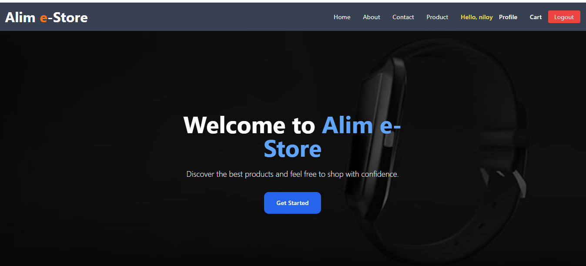

### Register & Login
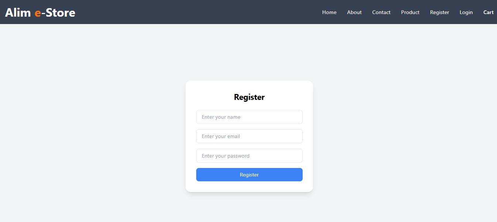
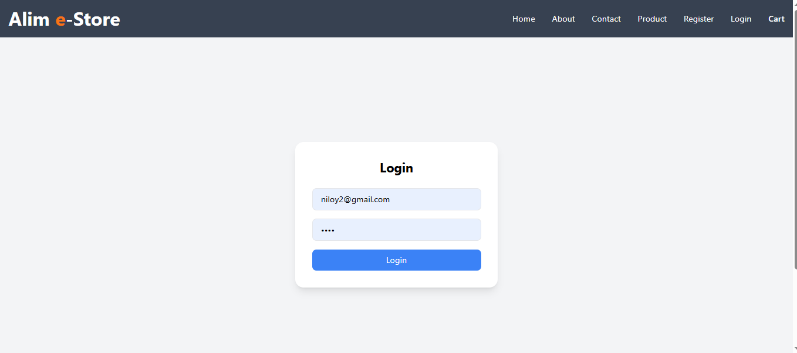

### Product Browsing
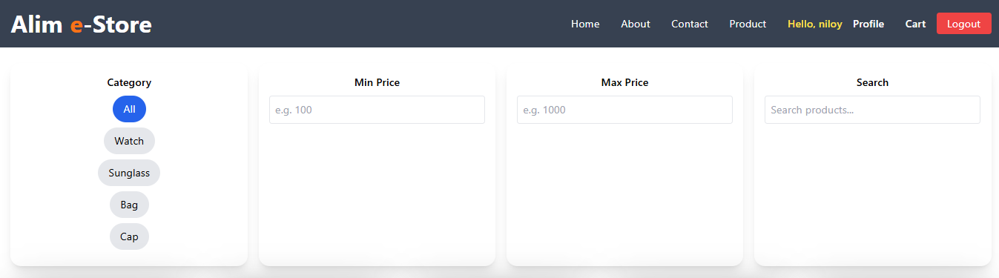
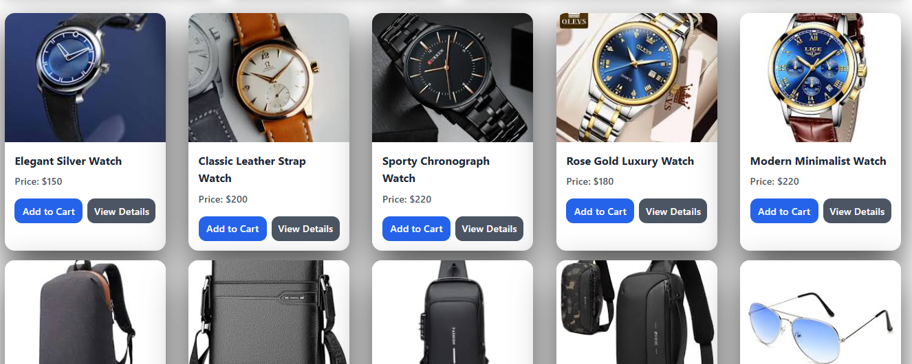
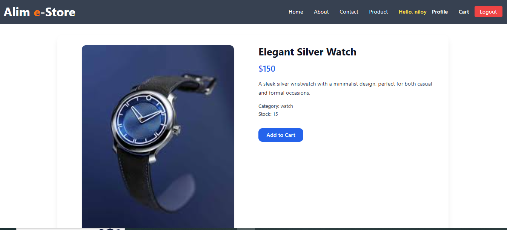

### Cart & Checkout
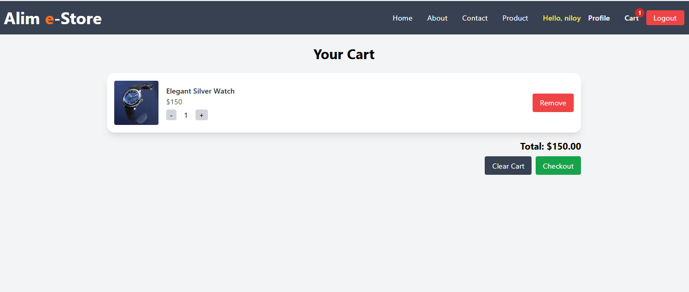
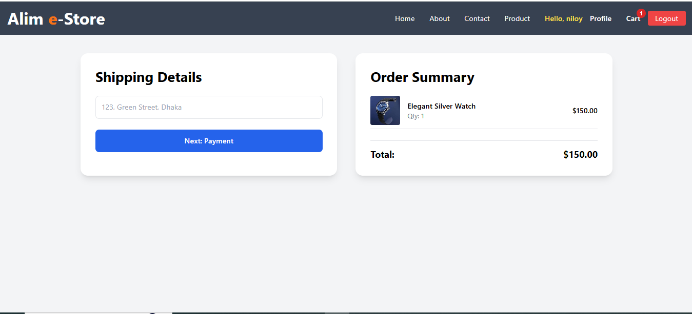
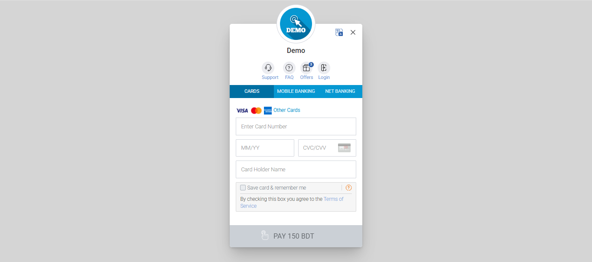

### User Profile & Info
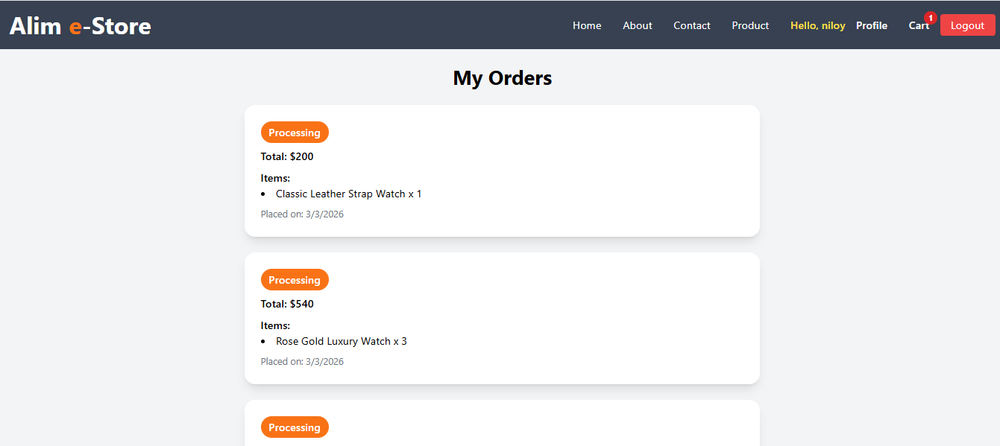
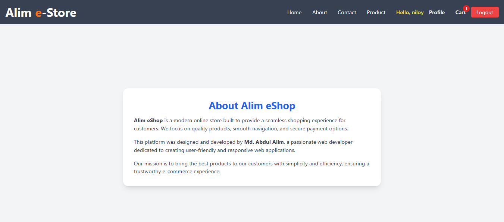
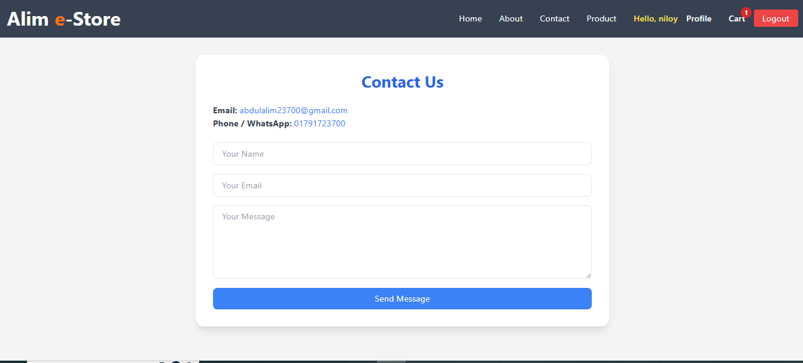

### Admin Panel
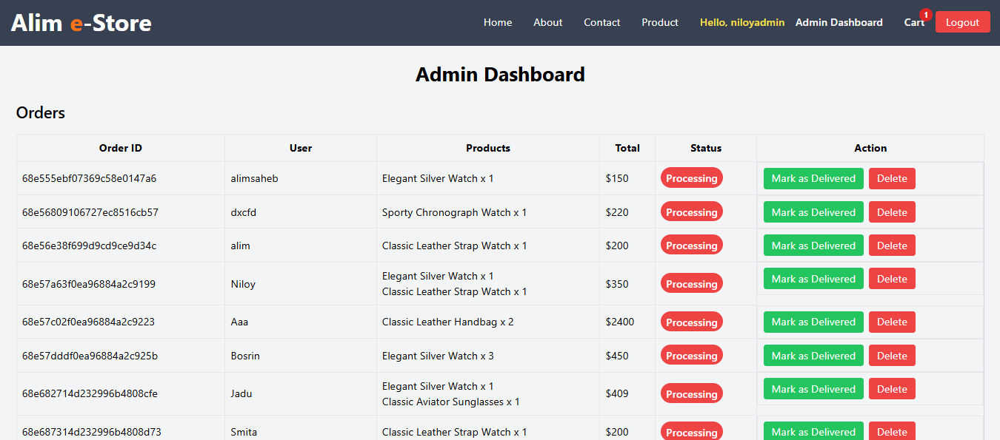
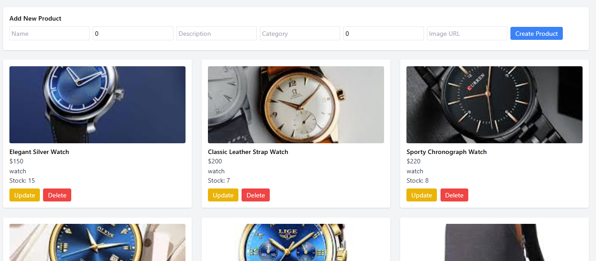

